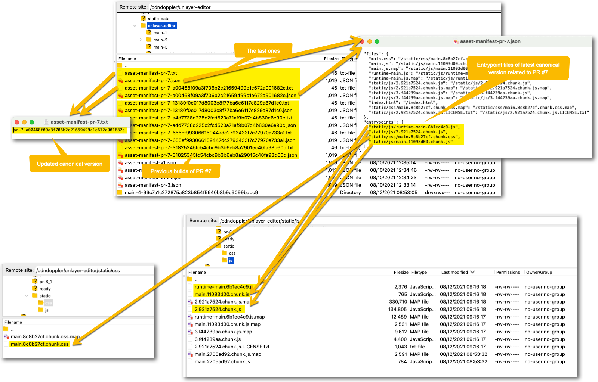

# Doppler Unlayer Editor

This project is a POC about adapting [Unlayer](https://unlayer.com/) to edit Doppler templates.

## Development

It is based on _Create React App_. You can learn more in the [Create React App documentation](https://facebook.github.io/create-react-app/docs/getting-started).

To learn React, check out the [React documentation](https://reactjs.org/).

### Available Scripts

In the project directory, you can run:

#### `yarn start`

Runs the app in the development mode.\
Open [http://localhost:3000](http://localhost:3000) to view it in the browser.

The page will reload if you make edits.\
You will also see any lint errors in the console.

#### `yarn test`

Launches the test runner in the interactive watch mode.\
See the section about [running tests](https://facebook.github.io/create-react-app/docs/running-tests) for more information.

#### `yarn verify-format`

Runs some code formatting validations:

- [ESLint](https://eslint.org/)
- [Prettier](https://prettier.io/)
- [EditorConfig](https://editorconfig.org/)

#### `yarn build`

Builds the app for production to the `build` folder.\
It correctly bundles React in production mode and optimizes the build for the best performance.

The build is minified and the filenames include the hashes.\
Your app is ready to be deployed!

See the section about [deployment](https://facebook.github.io/create-react-app/docs/deployment) for more information.

#### `yarn eject` (Create React App)

**Note: this is a one-way operation. Once you `eject`, you can’t go back!**

If you aren’t satisfied with the build tool and configuration choices, you can `eject` at any time. This command will remove the single build dependency from your project.

Instead, it will copy all the configuration files and the transitive dependencies (webpack, Babel, ESLint, etc) right into your project so you have full control over them. All of the commands except `eject` will still work, but they will point to the copied scripts so you can tweak them. At this point you’re on your own.

You don’t have to ever use `eject`. The curated feature set is suitable for small and middle deployments, and you shouldn’t feel obligated to use this feature. However we understand that this tool wouldn’t be useful if you couldn’t customize it when you are ready for it.

## CI / CD

We are using Jenkins as our CI/CD engine. [.Jenkinsfile](./.Jenkinsfile) is a declarative self documented file that you can use as the detailed documentation about the build and deployment process.

The build details can be found in [.Dockerfile](./.Dockerfile).

The details about how do we deal with [semantic version](https://semver.org/) and what are we uploading to the CDN are in [./build-n-publish.sh] and [cdn-helpers/prepare.sh](./cdn-helpers/prepare.sh)

This approach is very similar to what we are doing with Docker images. See a description in [doppler-forms project](https://github.com/MakingSense/doppler-forms#continuous-deployment-to-test-and-production-environments).

Basically it works in the following way:

### Pull requests

When a pull request is created or updated, a build process is run and, if it is successful, the files are uploaded to our CDN.

For example, for the [PR #7](https://github.com/FromDoppler/unlayer-editor/pull/7) it uploaded:

- `https://cdn.fromdoppler.com/unlayer-editor/asset-manifest-pr-7.json` - With the references to the actual files (.js and .css). This file is updated when a new commit is added to the PR.
- `https://cdn.fromdoppler.com/unlayer-editor/asset-manifest-pr-7-111c328b28a250b7117c5c04f28a31748414c712.json` - The canonical version, with the same content than the previous file, this file is not mutable.
- `https://cdn.fromdoppler.com/unlayer-editor/asset-manifest-pr-7.txt` with the detail about the last canonical version related to PR 7.



### `main` branch

When a commit is merged in the `main` branch a build process is run and, if it is successful, the files are uploaded to our CDN.

For example, currently these files are uploaded:

- `https://cdn.fromdoppler.com/unlayer-editor/asset-manifest-main.json` - With the references to the actual files (.js and .css). This file is updated when a new commit is pushed to the `main` branch.
- `https://cdn.fromdoppler.com/unlayer-editor/asset-manifest-main-fdf99016cce59a466dcecd17429af0b2d0f7b9f2.json` - The canonical version, with the same content than the previous file, this file is not mutable.
- `https://cdn.fromdoppler.com/unlayer-editor/asset-manifest-main.txt` with the detail about the last canonical version related to the `main` version.

### `INT` branch

When a commit is merged in the `INT` branch a build process is run and, if it is successful, the files are uploaded to our CDN.

For example, currently these files are uploaded:

- `https://cdn.fromdoppler.com/unlayer-editor/asset-manifest-INT.json` - With the references to the actual files (.js and .css). This file is updated when a new commit is pushed to the `INT` branch.
- `https://cdn.fromdoppler.com/unlayer-editor/asset-manifest-INT-fdf99016cce59a466dcecd17429af0b2d0f7b9f2.json` - The canonical version, with the same content than the previous file, this file is not mutable.
- `https://cdn.fromdoppler.com/unlayer-editor/asset-manifest-INT.txt` with the detail about the last canonical version related to the `INT` version.

### Version tags

When a tag is generated, a build process is run and, if it is successful, the files are uploaded to our CDN.

For example, currently for tag `v1.0.0`:

- `https://cdn.fromdoppler.com/unlayer-editor/asset-manifest-v1.json` - With the references to the actual files (.js and .css). This file is updated when a new tag with the format `v1.#.#` is generated.
- `https://cdn.fromdoppler.com/unlayer-editor/asset-manifest-v1.txt` with the detail about the last canonical version related to a `v1.#.#` version.
- `https://cdn.fromdoppler.com/unlayer-editor/asset-manifest-v1.0.json` - With the references to the actual files (.js and .css). This file is updated when a new tag with the format `v1.0.#` is generated.
- `https://cdn.fromdoppler.com/unlayer-editor/asset-manifest-v1.0.txt` with the detail about the last canonical version related to a `v1.0.#` version.
- `https://cdn.fromdoppler.com/unlayer-editor/asset-manifest-v1.0.0.json` - With the references to the actual files (.js and .css). This file is updated when a new tag with the format `v1.0.0` is generated.
- `https://cdn.fromdoppler.com/unlayer-editor/asset-manifest-v1.0.0.txt` with the detail about the last canonical version related to a `v1.0.0` version.
- `https://cdn.fromdoppler.com/unlayer-editor/asset-manifest-v1.0.0-fdf99016cce59a466dcecd17429af0b2d0f7b9f2.json` - The canonical version, with the same content than the previous files, this file is not mutable.

### Static files

All the static files referenced in the `asset-manifest-*` files are stored in `http://cdn.fromdoppler.com/unlayer-editor/static`.

## Embed the editor

To use the editor, you should include a reference to the desired `asset-manifest-*` file. For example:

- `asset-manifest-v1.json`, you will have the last final versions until a breaking change increment the mayor version to `v2`.
- `asset-manifest-main.json`, you will have the last code merged the `main` branch.
- `asset-manifest-INT.json`, you will have the last code pushed to the `INT` branch.

Currently in Doppler [we are always using the v1](https://github.com/MakingSense/Doppler/blob/f89184ce5e16bc326809f5b224a478621bf75fbb/Doppler.Presentation.MVC/UnlayerEditorPoc/index.html#L26):

```html
<html lang="en">
<head>
    <!-- . . . -->
    <script src="https://cdn.fromdoppler.com/loader/v1/loader.js"></script>
</head>

<body>
    <!-- . . . -->
    <script type="text/javascript">
        (new AssetServices()).load("https://cdn.fromdoppler.com/unlayer-editor/asset-manifest-v1.json", []);
    </script>
    <!-- . . . -->
</body>
</html>
```
